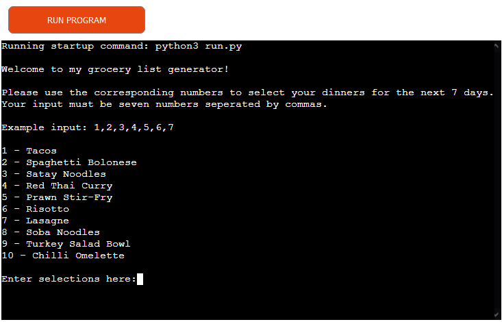
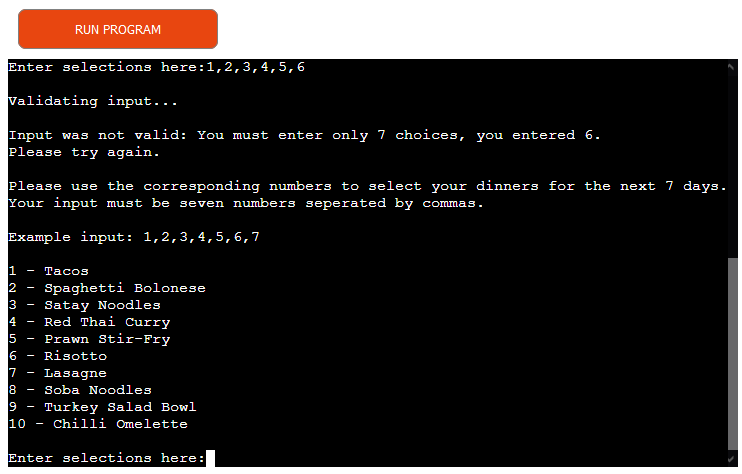
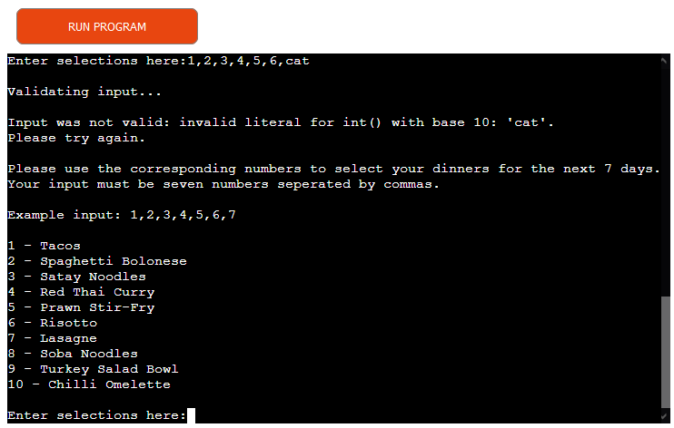
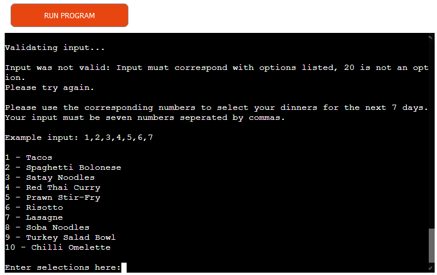
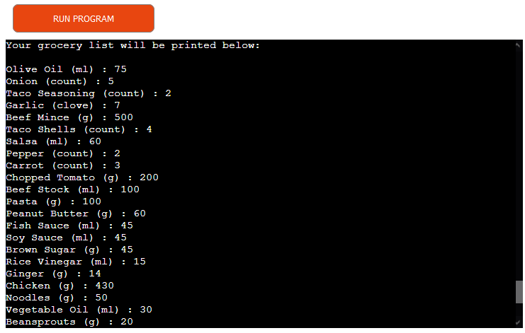
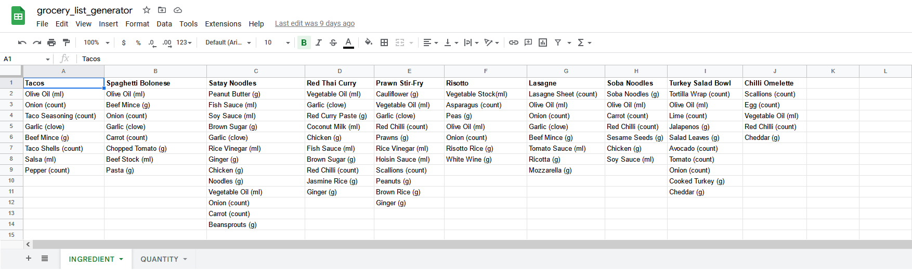
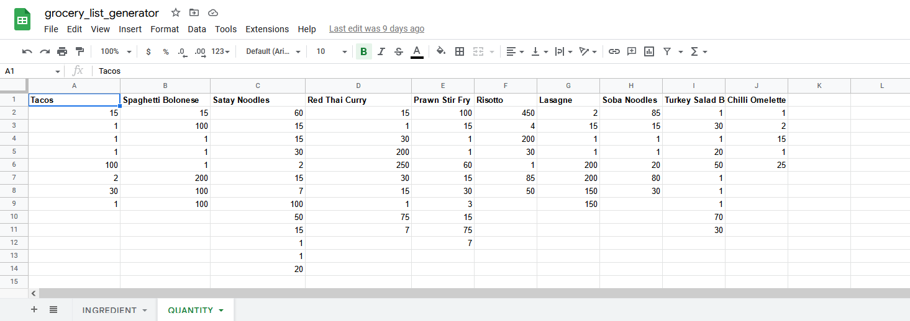
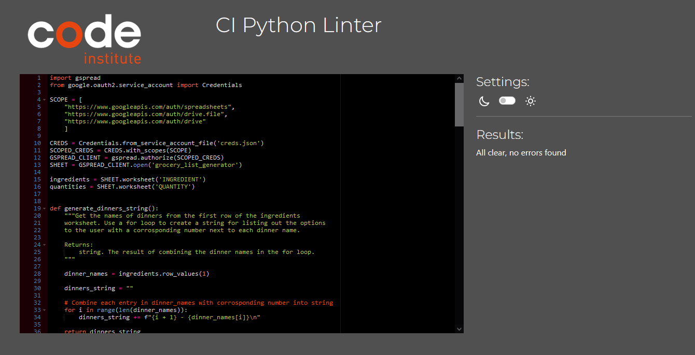

# Grocery List Generator
This program is a terminal based grocery list generator written in python that integrates with google sheets through the gspread API. The program has meal options with ingredient and quantity data stored in google sheets and using input from the user, it will pull the ingredients and quanities needed for each meal to calculate a grocery list of what is needed to make them.

The purpose of this program is to simplify the process of making meal decisions for the user and automate calculating what is needed once meals are decided upon. It is currently built with a single person doing a weekly shop in mind and has 10 different options for dinners. The data for ingredients and quantities for meals is stored in google sheets rather than hard coded into python so they can be edited, removed or new meals can be added to the google sheet and the program will keep up with the current data. 

[Link to the live project](https://grocery-list-maker.herokuapp.com/)

# Features
## Current Features

- Initial Screen
    - This shows first once the program is run to welcome the user, provide instructions on how to use the program and print out the options available to the user before asking the user for input. 
    - The list of meals printed is pulled from a worksheet in google sheets and each is given a unique number in order of their appearance in the worksheet so the user can easily select between them using numbers in their input. 
    - When the user enters their input, the program will let the user know their input is being validated before either showing an invalid input screen or starting to calculate their grocery list upon valid input.

- Input Validation
	-  The users input must be in CSV format, be only 7 integer values and in the range of options shown.
    - When the user enters their input and it does not meet the required format, the program will tell the user their input was not valid, give the specific reason why and show which part was invalid or how many were entered. 
    - Upon invalid input, the options available and instructions are printed again before asking the user to retry input.
    - The user will be asked for input continuously until they provide input that is valid. 

- Calculating the grocery list
    - Once the user has given input that the program can use, text will be printed to let the user know that the program is calculating their grocery list.
	- The program will use each value from the input to select and gather the ingredient and quantity data for the selected meals from google sheets and calculate a grocery list for the user then print that list with the ingredient, unit of measurement and quantity for each ingredient. 
	- After the list is printed the user will be asked if they want to run the program again by entering 'y' or exit by entering any other key.
	- On entering 'y', the program will go back to the start and reprint out the instructions, options available and ask for input again. 
	- On any other input, the program will print out a goodbye/thank you message and the program is finished. 

- Google sheets integration
	-  This program uses the gspread API to interact with google sheets where the data for the meals is stored. 
	- The google sheets has 2 worksheets in it, one worksheet for the ingredients of each dinner and another for the quantities of those ingredients.
	- The titles of the dinners are listed on the top most row with the ingredients and quantities below.
	- The order of ingredients and quantites must match between the worksheets so that they can be combined in python.

## Possible Future Features
- An option to allow the user to select a meal and print out the needed ingredients and quantities for just that meal. 
- Add the method for making each meal that can be printed alongside the ingredients and quantities. 
- Add functionality for the user to select breakfast and lunch meals in addition to the dinners. 
- Allow the user to select how many days they would like to shop for instead of only weekly shops. 
- Allow the user to select how many people they are shopping for instead of defaulting to 1 person.
- Add an option to add and remove meals from the google sheets from within the terminal without having to access the google sheets. 
- Connect the app to google keep or another note taking app and send the grocery list to that app instead of only printing to the terminal. 

# Testing
## Validator Testing
- Python
	- No major issues found when run through a PEP8 linter. [Code Institute's PEP8 linter](https://pep8ci.herokuapp.com/).

## Manual Testing

| Test Label             | Test Action                   | Expected Result                                                                                                                                                      | Test Outcome |
|------------------------|-------------------------------|----------------------------------------------------------------------------------------------------------------------------------------------------------------------|--------------|
| Options are listed accurately and in order          | Compare listed options to google sheet manually    | Options listed by program should match the order of meal names in google sheets and change when names are added/removed/edited in the google sheet.                                                                                                 | PASS         |
| Validate input for 7 values           | Enter more or less than 7 values     | The program will tell the user they must enter 7 values and tell the user how many they entered last time.                                                                                                 | PASS         |
| Validate input for integer values   | Enter non integer value      | The program will tell the user there was an invalid input for int type and print which input was invalid.                                                                                 | PASS         |
| Validate input is in available range | Enter number outside range of available meals  | The program will tell the user an input was not in available options and print which was invalid.                                                            | PASS         |
| Ask user for input until valid input is entered    | Enter multiple invalid inputs  | Program will tell user that input was invalid before reprinting instructions, options available and prompt user for input again until valid.                         | PASS         |
| Calculate grocery list accurately| Enter valid input and manually calculate from google sheets    | The calculated grocery list in the program should match what I have calculated manually using the google sheets data.                                                                         | PASS         |
| Validate input to rerun program          | Enter 'y' or 'Y' when prompted    | The program should reprint instructions and options available on entering 'y' or 'Y' only and exit on anything else.                                                           | PASS         |

## Fixed Bugs
- I was having an issue with deployment to heroku where it was not recognizing gspread but this was becuase I had not made the requirements.txt file correctly and was easily fixed by going back over that process.

## Unfixed Bugs
- No unfixed bugs that I am aware of. 

# Deployment
The website is currently deployed to Heroku.

The steps to deploy it were as follows: 
- Create/Login to Heroku account. 
- Create a new app in Heroku with a unique title. 
- Set the apps buildpacks to Python and NodeJS in that order.
- Link that app to the repository needed on github. 
- Add your creds.json file to convig vars in settings along with another config var for PORT with a value of 8000. 
- In the deploy tab, select from either automatic deployment or manual deployment for your app. 

Once deployed to Heroku with automatic deployment, the program will automatically update with new pushes to the repository. 

Alternatively, you can choose manual deployment below where you select automatic deployment if you only want to deploy after certain changes. 

This repository can be cloned by entering the command `git clone https://github.com/alexkavanagh-dev/grocery-list-generator.git` into the terminal of your chosen IDE.

The link for my website on GitHub Pages is here: https://github.com/alexkavanagh-dev/grocery_list_generator

# Credits

- The gspread APIwas used to interact with the google sheets through python. The gspread documentation  is [here](https://docs.gspread.org/en/latest/user-guide.html).
-  www.w3schools.com/ was, as always, a great resource that I used throughout this whole project. 
- Code Institute for their python project template which contains the HTML, CSS, Javascript and other files to allow deployment to Heroku. 